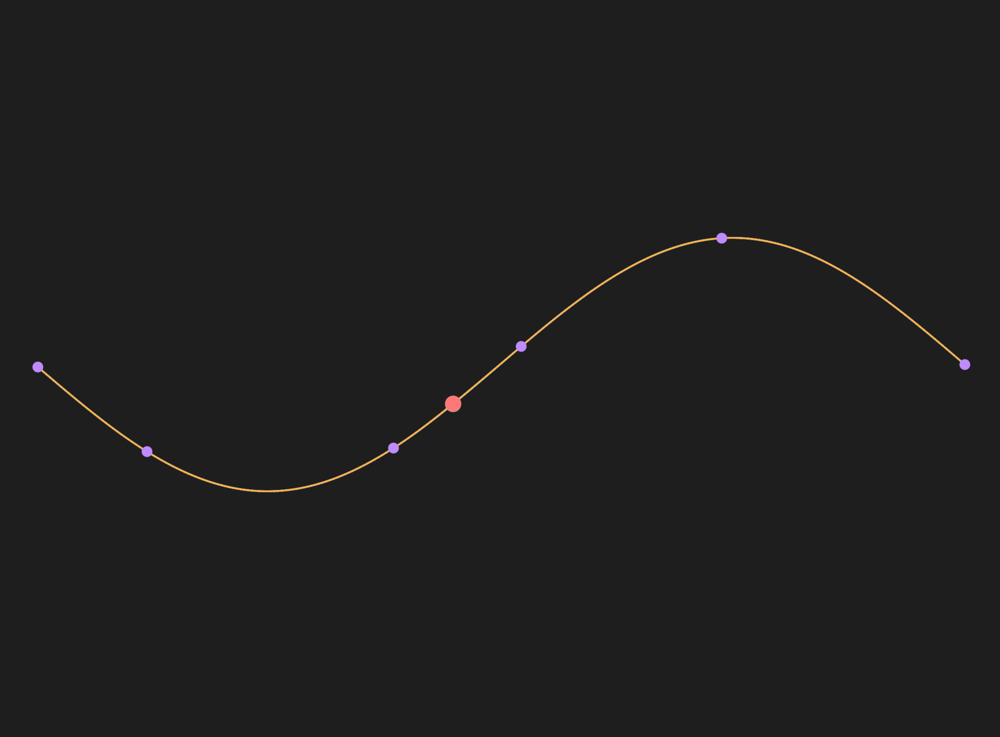
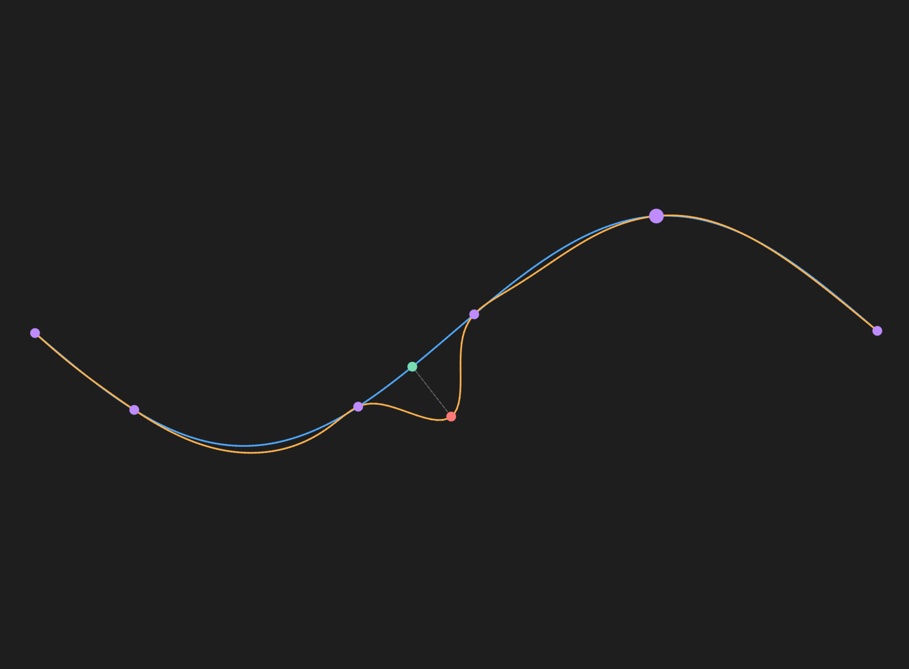
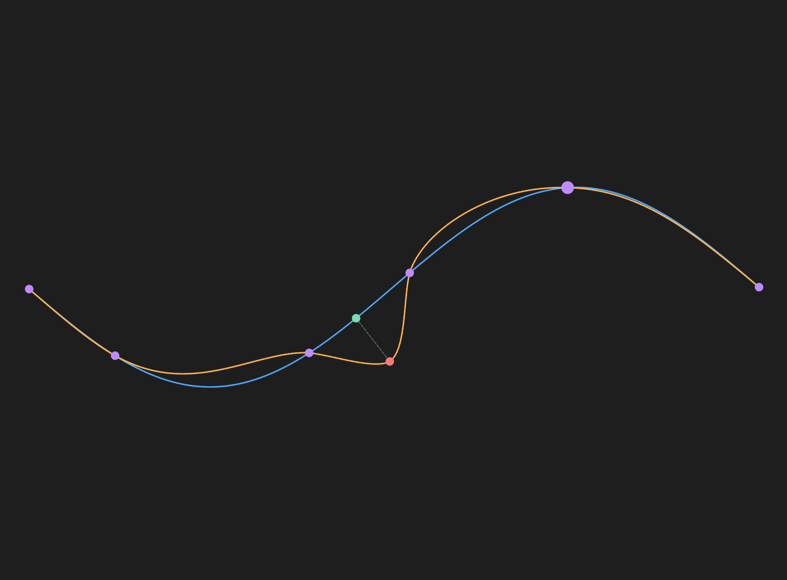

# MLS 在局部曲线编辑中的应用

## 目录

1. [开篇](#1-开篇)
2. [问题定义：我们想要什么样的曲线编辑？](#2-问题定义我们想要什么样的曲线编辑)
3. [核心直觉：把局部编辑当成「加权变换」](#3-核心直觉把局部编辑当成加权变换)
4. [数学骨架：精简化公式](#4-数学骨架精简化公式)
5. [代码实战：计算局部变换矩阵](#5-代码实战计算局部变换矩阵)
6. [效果展示](#6-效果展示)
7. [总结](#7-总结)

---

## 1. 开篇

### 1.1 一个直观的场景

想象你在用矢量绘图软件（如 Illustrator、Inkscape）编辑一条曲线。你希望让曲线在一个点附近自然隆起，而远处的部分纹丝不动。

**Moving Least Squares (MLS)** 是一个合适的曲线编辑方法。那么，这种方法如何实现「局部性」？

---

## 2. 问题定义：我们想要什么样的曲线编辑？

### 2.1 输入与输出

| 输入 | 符号 | 说明 |
|------|------|------|
| 原始曲线上的离散点集 | \( \mathbf{v} \) | 由折线近似表示的曲线采样点 |
| 用户拖拽的源控制点 | \( \mathbf{p}_i \) | 用户拾取的曲线上一点（原始位置） |
| 拖拽目标位置 | \( \mathbf{q}_i \) | 用户将 \( \mathbf{p}_i \) 拖拽到的新位置 |
| 位移向量 | \( \Delta = \mathbf{q}_i - \mathbf{p}_i \) | 用户的编辑输入 |

| 输出 | 符号 | 说明 |
|------|------|------|
| 变形后的曲线点集 | \( f(\mathbf{v}) \) | 每个原始点 \( \mathbf{v} \) 的新位置 |

> 一般情形：用户可给出多个控制点对 \( \{(\mathbf{p}_i, \mathbf{q}_i)\}_{i=1}^n \)，MLS 统一处理。

### 2.2 核心约束

| 约束 | 数学表达 | 含义 |
|------|----------|------|
| **插值约束** | \( f(\mathbf{p}_q) = \mathbf{q} \) | 被拖拽的点精确到达目标位置 |
| **局部性** | \( \|f(\mathbf{v}) - \mathbf{v}\| \to 0 \) 当 \( \|\mathbf{v} - \mathbf{p}_q\| \to \infty \) | 距离拖拽点越远，位移越小 |
| **平滑性** | 尽可能光滑 | 相邻点位移过渡自然，不出现折痕 |

### 2.3 为什么不用其他方法？

| 方法 | 问题 |
|------|------|
| 径向基函数 (RBF) | 全局支撑，远处也会被拖歪 |
| **MLS** | 封闭解、单点计算独立、局部可控、支持多约束 |

---

## 3. 核心直觉：把局部编辑当成「加权变换」

### 3.1 一句话核心

> 对于曲线上的每个点 \( \mathbf{v} \)，MLS 会问：  
> *「如果控制点从 \( \mathbf{p}_i \) 移动到 \( \mathbf{q}_i \)，我应该跟着动多少？」*  
> 答案取决于 **我到每个控制点的距离**。

### 3.2 加权思想

MLS 的核心洞察是：**距离越近的控制点，对当前点的「影响力」越大**。

- 离 \( \mathbf{v} \) 很近的控制点：它的位移会强烈影响 \( \mathbf{v} \)
- 离 \( \mathbf{v} \) 很远的控制点：几乎不影响 \( \mathbf{v} \)

这种「影响力」通过 **权重函数** \( w_i(\mathbf{v}) \) 量化。

### 3.3 直观类比

**捏橡皮泥**：捏住一个点往外拉——

- 最近的点跟着走得很彻底
- 稍远的点被轻微扯动
- 远处的点完全不受影响

MLS 就是把这个直觉公式化了。

---

## 4. 数学骨架：精简化公式

### 4.1 权重函数

衡量点 \( \mathbf{v} \) 受控制点 \( \mathbf{p}_i \) 的影响程度：

\[
w_i(\mathbf{v}) = \frac{1}{\|\mathbf{p}_i - \mathbf{v}\|^{2\alpha}}, \quad \alpha > 0
\]

- \( \alpha \) 控制衰减速度（通常 \( \alpha = 1 \) 或 \( 2 \)）

### 4.2 加权中心

为使变换与绝对位置解耦，先计算加权质心：

\[
\mathbf{p}_* = \frac{\sum_i w_i \mathbf{p}_i}{\sum_i w_i}, \quad
\mathbf{q}_* = \frac{\sum_i w_i \mathbf{q}_i}{\sum_i w_i}
\]

相对偏移量：

\[
\hat{\mathbf{p}}_i = \mathbf{p}_i - \mathbf{p}_*, \quad
\hat{\mathbf{q}}_i = \mathbf{q}_i - \mathbf{q}_*
\]

### 4.3 变形函数基本形式

MLS 假设变形是**平移 + 线性变换**：

\[
f(\mathbf{v}) = (\mathbf{v} - \mathbf{p}_*) \mathbf{M} + \mathbf{q}_*
\]

其中 \( \mathbf{M} \) 是一个 \( 2\times 2 \) 矩阵，通过加权最小二乘确定：

\[
\min_{\mathbf{M}} \sum_i w_i \|\hat{\mathbf{p}}_i \mathbf{M} - \hat{\mathbf{q}}_i\|^2
\]

### 4.4 仿射变换 (Affine) — 最灵活

不对 \( \mathbf{M} \) 加额外约束，允许缩放、旋转、剪切。

定义加权协方差矩阵：

\[
\mathbf{S}_{pp} = \sum_i w_i \hat{\mathbf{p}}_i^\top \hat{\mathbf{p}}_i, \quad
\mathbf{S}_{pq} = \sum_i w_i \hat{\mathbf{p}}_i^\top \hat{\mathbf{q}}_i
\]

最优解满足正规方程：

\[
\mathbf{S}_{pp} \mathbf{M}_{\text{affine}}^\top = \mathbf{S}_{pq}
\]

即：

\[
\mathbf{M}_{\text{affine}}^\top = \mathbf{S}_{pp}^{-1} \mathbf{S}_{pq}
\]

### 4.5 相似变换 (Similarity) — 保形状

限制 \( \mathbf{M} \) 为旋转 + 均匀缩放形式（二维）：

\[
\mathbf{M}_{\text{sim}} = \begin{bmatrix}
a & -b \\
b & a
\end{bmatrix}
\]

定义：

\[
\mu_s = \sum_i w_i \|\hat{\mathbf{p}}_i\|^2
\]

\[
a = \sum_i w_i \left(\hat{p}_{i,x}\hat{q}_{i,x} + \hat{p}_{i,y}\hat{q}_{i,y}\right)
\]

\[
b = \sum_i w_i \left(\hat{p}_{i,x}\hat{q}_{i,y} - \hat{p}_{i,y}\hat{q}_{i,x}\right)
\]

则：

\[
\mathbf{M}_{\text{sim}} = \frac{1}{\mu_s} \begin{bmatrix}
a & -b \\
b & a
\end{bmatrix}
\]

当 \( \mu_s = 0 \) 时退化为纯平移。

### 4.6 最终变形

\[
f_{\text{affine}}(\mathbf{v}) = (\mathbf{v} - \mathbf{p}_*) \mathbf{M}_{\text{affine}} + \mathbf{q}_*
\]

\[
f_{\text{similarity}}(\mathbf{v}) = (\mathbf{v} - \mathbf{p}_*) \mathbf{M}_{\text{sim}} + \mathbf{q}_*
\]

---

## 5. 代码实战：计算局部变换矩阵

对曲线上的查询点 \(\mathbf{v}\)，先由控制点对 \(\{(\mathbf{p}_i,\mathbf{q}_i)\}\) 算权重与加权中心，再按 §4.4 / §4.5 求 \(2\times2\) 矩阵 \(\mathbf{M}\)。

```python
import numpy as np

def mls_local_matrix(v, p, q, *, alpha=1.0, mode="affine", eps=1e-8):
    """给定查询点 v 与控制点数组 p, q，返回局部矩阵 M 与加权中心 p_star, q_star。"""
    p = np.asarray(p, dtype=float)
    q = np.asarray(q, dtype=float)
    v = np.asarray(v, dtype=float)

    # §4.1 权重
    d2 = np.sum((p - v) ** 2, axis=1)
    w = 1.0 / np.maximum(d2, eps) ** alpha
    w_sum = w.sum()

    # §4.2 加权中心与相对偏移
    p_star = (p * w[:, None]).sum(axis=0) / w_sum
    q_star = (q * w[:, None]).sum(axis=0) / w_sum
    p_hat = p - p_star
    q_hat = q - q_star

    if mode == "affine":
        # §4.4  S_pp M^T = S_pq  =>  M = pinv(S_pp) @ S_pq
        spp = np.einsum("i,ij,ik->jk", w, p_hat, p_hat)
        spq = np.einsum("i,ij,ik->jk", w, p_hat, q_hat)
        M = np.linalg.pinv(spp + eps * np.eye(2)) @ spq
    else:
        # §4.5  similarity
        mu = np.sum(w * np.sum(p_hat * p_hat, axis=1))
        a = np.sum(w * np.sum(p_hat * q_hat, axis=1))
        b = np.sum(w * (p_hat[:, 0] * q_hat[:, 1] - p_hat[:, 1] * q_hat[:, 0]))
        if mu <= eps:
            M = np.eye(2)
        else:
            M = (1.0 / mu) * np.array([[a, -b], [b, a]], dtype=float)

    return M, p_star, q_star


if __name__ == "__main__":
    v = np.array([1.0, 0.5])
    p = np.array([[0.0, 0.0], [2.0, 0.0]])
    q = np.array([[0.2, 0.1], [2.5, 0.3]])

    M, p_star, q_star = mls_local_matrix(v, p, q, alpha=1.0, mode="similarity")
    f_v = (v - p_star) @ M + q_star  # §4.6
    print("M =\n", M)
    print("p_star =", p_star, "q_star =", q_star)
    print("f(v) =", f_v)
```

---

## 6. 效果展示

在同一组控制点对下，对比原始曲线、MLS（similarity）与 RBF 的变形效果。

### 6.1 原始控制点对



### 6.2 MLS（similarity）



### 6.3 RBF（薄板样条）

RBF 方法中仿射部分为单位阵，径向部分选取薄板样条核函数：

\[
\phi(r) = r^2 \log r
\]



---

## 7. 总结

MLS 通过距离加权，为曲线上每个点独立求解局部变换矩阵，从而在满足插值约束的同时实现局部、平滑的曲线编辑。仿射模式最灵活，相似变换模式则更好地保持局部形状。与全局 RBF 相比，MLS 的局部支撑更适合交互式矢量编辑场景。

---

## 参考文献

1. Schaefer, S., McPhail, T., & Warren, J. (2006). [Image deformation using moving least squares](https://doi.org/10.1145/1141911.1141920). *ACM Transactions on Graphics (TOG)*, 25(3), 533–540.
